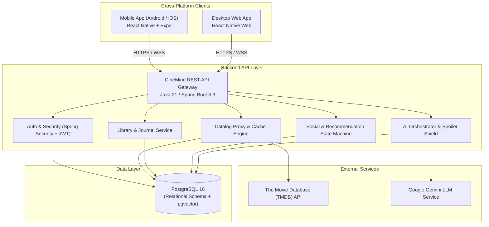

# CineMind 🎬🧠

> **Cross-Platform AI Movie Journal & Social Recommendation Platform**  
> *Your movie memory. Your AI movie assistant. Your friends' recommendations.*

[](https://expo.dev)
[](https://reactnative.dev)
[](https://spring.io/projects/spring-boot)
[](https://www.postgresql.org)
[](https://deepmind.google/technologies/gemini)
[](LICENSE)

---

## 📌 Executive Summary

**CineMind** is a unified, cross-platform movie companion application designed to eliminate movie decision paralysis and transform how people document and share cinema.

Instead of relying on generic public star ratings or scattered chat recommendations, CineMind combines:
1. **Personal Movie Journal:** A rich, private viewing log with 1.0–10.0 ratings (0.5 increments), rewatch counts, viewing contexts (theater, home solo, etc.), and custom tags.
2. **AI Movie Assistant:** Spoiler-safe film intelligence providing taste-aligned Match Scores (0–100%), pacing/tone breakdowns, and streaming conversational Q&A.
3. **Accountable Social Recommendations:** Direct friend-to-friend movie recommendations with a deterministic 5-stage lifecycle and recommendation success attribution.

---

## 🌟 Key Features

### 📖 Personal Movie Library & Journal
- **4-Status Lifecycle:** Organize movies into `Want to Watch`, `Watching`, `Watched`, and `Dropped`.
- **Cinephile-Grade Ratings:** Granular 1.0 to 10.0 scale in 0.5 steps with half-star visual rendering.
- **Rewatch Tracker:** Automatic repeat viewing counter and timestamp logging.
- **Private Reflections:** Rich markdown journal notes with viewing context tracking (e.g., Theater, Airplane, Home Group) strictly isolated to the user (`403 Forbidden` for other users).

### 🤖 AI Pre-Watch Intelligence & Q&A
- **Strict Spoiler-Free Default:** All pre-watch summaries, tone/pacing analyses, and conversational Q&A strictly omit major plot twists and endings.
- **Intentional Spoiler Override:** Requires explicit two-step user confirmation before unlocking deep plot discussion.
- **Taste Profile Synthesis:** Automatically evolves user preference vectors based on watch history, ratings, and favorites.
- **Mood-Based Discovery:** Natural language prompts (e.g., *"atmospheric slow-burn mystery with great soundtrack"*) translated into taste-calibrated recommendations.
- **Streaming Q&A:** Real-time conversational movie inquiries powered by Server-Sent Events (SSE) with time-to-first-token $\le 1.2\text{s}$.

### 🤝 Social Recommendations with 5-Stage Lifecycle
- **Direct Recommendations:** Recommend specific titles directly to confirmed friends with a personal pitch (up to 500 characters).
- **Deterministic 5-Stage Tracking:**
  $$\text{Pending} \longrightarrow \text{Seen} \longrightarrow \text{Added to Watchlist} \longrightarrow \text{Watched} \longrightarrow \text{Rated}$$
- **Automated Lifecycle Synchronization:** Adding a recommended film to your library or marking it watched automatically updates the recommendation status for both sender and recipient.
- **Recommendation Quality Attribution:** Measures friend recommendation success rates and highlights your most trusted movie advisors.

---

## 🏗️ High-Level System Architecture



---

## 📚 Canonical Documentation Index

In accordance with [Project Brief (Section 14)](docs/project_brief.md), the CineMind engineering specification is organized into 6 canonical documents:

| # | Specification Document | Direct Link | Primary Scope & Contents |
| :---: | :--- | :--- | :--- |
| **01** | **Project Brief** | [docs/project_brief.md](docs/project_brief.md) | Product vision, target personas, core loops, MVP scope, and product positioning. |
| **02** | **System Architecture** | [docs/system-architecture.md](docs/system-architecture.md) | C4 models, frontend/backend architecture, TMDB & Gemini AI proxies, security boundaries, and ADRs. |
| **03** | **Product Requirements (PRD)** | [docs/product-requirements.md](docs/product-requirements.md) | Functional (`FR-*`), Non-Functional (`NFR-*`), UI State Matrix, and Destructive Action Safety. |
| **04** | **User Stories & Backlog** | [docs/user-stories.md](docs/user-stories.md) | 8 Epics, 30 User Stories, Gherkin acceptance criteria (`Given-When-Then`), MoSCoW priorities. |
| **05** | **REST API Specification** | [docs/api-specification.md](docs/api-specification.md) | OpenAPI 3.1 REST endpoints, JSON envelopes, JWT auth, SSE streaming for AI Q&A. |
| **06** | **Database Design** | [docs/database-design.md](docs/database-design.md) | PostgreSQL 16 schema, Mermaid ERD, table DDL, check constraints, GIN/HNSW indexes, triggers. |

---

## 🛠️ Technology Stack

| Domain | Technology | Rationale & Responsibility |
| :--- | :--- | :--- |
| **Mobile & Web Client** | **React Native (v0.74+) + Expo SDK 51+** | Single cross-platform codebase targeting Android, iOS, and Web. |
| **Language** | **TypeScript 5.x (Strict)** | Unified types across frontend UI, client state, and backend API contracts. |
| **Navigation** | **Expo Router v3** | Universal file-based routing and deep-linking support across native and web. |
| **Client State** | **TanStack Query v5 + Zustand** | TanStack Query for server state caching; Zustand for local UI flags. |
| **Backend API** | **Java 21 + Spring Boot 3.3.x** | Enterprise layered architecture (Controllers, Services, Gateways, Spring Data JPA Repositories). |
| **Database** | **PostgreSQL 16 + `pgvector`** | ACID relational storage, JSONB histogram indexing, and in-database taste embeddings via Flyway migrations. |
| **Movie Metadata** | **TMDB API** | Proxied and cached server-side in `movie_cache` to minimize rate limits. |
| **AI LLM Engine** | **Google Gemini API** | Server-side prompt orchestration with strict spoiler quarantine guardrails. |
| **DevOps & Runtime** | **Docker & Docker Compose** | Reproducible multi-stage development and production container environments. |

---

## 📂 Repository Structure

```text
cinemind/
├── README.md                 # Project overview and master index (this file)
├── .gitignore                # Universal gitignore (Java, Node, Expo, Env)
├── .env.example              # Environment variables template
├── docs/                     # Canonical engineering documentation (01 to 06)
│   ├── project_brief.md
│   ├── system-architecture.md
│   ├── product-requirements.md
│   ├── user-stories.md
│   ├── api-specification.md
│   └── database-design.md
├── server/                   # Backend REST API (Java 21 / Spring Boot 3.3 / Maven)
│   ├── pom.xml
│   ├── src/main/java/com/cinemind/
│   │   ├── config/           # SecurityConfig, CorsConfig
│   │   ├── security/         # JwtTokenProvider, JwtAuthFilter
│   │   ├── common/           # ApiResponse, GlobalExceptionHandler
│   │   ├── domain/           # JPA Entities (User, LibraryEntry, etc.)
│   │   ├── repository/       # Spring Data JPA Repositories
│   │   ├── service/          # Domain services (Auth, Movie, AI, etc.)
│   │   ├── controller/       # REST Controllers
│   │   └── gateway/          # TMDB & Gemini AI Gateways
│   └── src/main/resources/
│       ├── application.yml
│       └── db/migration/     # Flyway migrations (PostgreSQL DDL & Triggers)
└── client/                   # Frontend App (React Native + Expo SDK 51 + TypeScript)
    ├── package.json
    ├── app.json
    ├── app/                  # Expo Router v3 (File-based routes)
    └── src/                  # API client, domain types, components
```

---

## 🚀 Getting Started

### Prerequisites
- **Node.js:** `v20.x` or later (LTS recommended)
- **Package Manager:** `pnpm` (`v9.x`) or `npm`
- **Docker & Docker Compose:** For running PostgreSQL 16 with `pgvector`
- **Expo CLI:** `npx expo`
- **API Keys:**
  - [TMDB API Key](https://developer.themoviedb.org/docs)
  - [Google Gemini API Key](https://ai.google.dev/)

### Local Development Setup

1. **Clone the repository:**
   ```bash
   git clone https://github.com/your-username/cinemind.git
   cd cinemind
   ```

2. **Configure Environment Variables:**
   ```bash
   cp .env.example .env
   ```
   Provide your local PostgreSQL credentials, JWT secret, TMDB API key, and Gemini API key.

3. **Start Database Services:**
   ```bash
   docker compose up -d postgres
   ```

4. **Start Backend API Server (Spring Boot):**
   ```bash
   cd server
   # Using Maven Wrapper (recommended):
   ./mvnw spring-boot:run    # On Linux/macOS
   .\mvnw.cmd spring-boot:run  # On Windows (PowerShell/CMD)

   # Or using global Maven:
   mvn spring-boot:run
   # API running at http://localhost:8080/api/v1 (Flyway executes migrations automatically)
   ```

5. **Start Frontend Client (React Native / Expo):**
   ```bash
   cd client
   npm install
   npx expo start
   # Press 'a' for Android, 'i' for iOS, or 'w' for Web
   ```

---

## 🔒 Security & Privacy Guarantees

- **No Plaintext Passwords:** Passwords hashed with `Argon2id` (memory cost: 64MB, time cost: 3).
- **Private-by-Default:** Journal entries and private viewing notes are accessible only by the authenticated owner (`NFR-SEC-01`).
- **Spoiler Quarantine:** Dual-layer defense (system prompt quarantine + client confirmation modal) preventing accidental plot revelations (`NFR-SAFE-01`).
- **No Third-Party Secret Leaks:** TMDB and Gemini API keys are never bundled into client apps or exposed in web network traffic.

---

## 📄 License

This project is licensed under the [MIT License](LICENSE) — see the LICENSE file for details.
