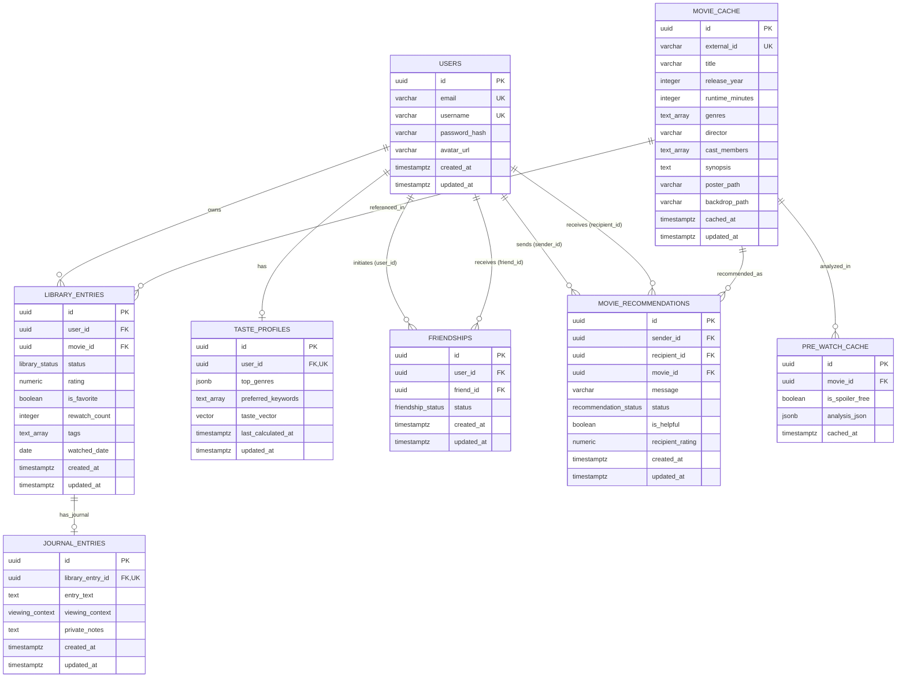

# CineMind — Database Design & Schema Specification

> **Document Type:** Database Design & Schema Specification  
> **Document Number:** 06 — Database Design  
> **Target Version:** MVP 1.0  
> **Status:** Approved Baseline  
> **Target Engine:** PostgreSQL 16+ with `pgvector` & `pgcrypto`  
> **Traceability References:**  
> - Project Brief: `docs/project_brief.md`  
> - Product Requirements Document: `docs/product-requirements.md`  
> - System Architecture Document: `docs/system-architecture.md`  
> - REST API Specification: `docs/api-specification.md`  

---

## 1. Schema Overview & Design Principles

The CineMind data architecture utilizes PostgreSQL 16 as its single authoritative relational and vector persistence store.

### Core Principles
1. **Strict Relational Integrity:** Explicit foreign keys with carefully designated `ON DELETE` cascading rules prevent orphan records across friendships and library entries.
2. **UUID Primary Keys:** All primary keys utilize UUIDv4 (`gen_random_uuid()`) to prevent enumeration attacks and support distributed/client offline generation.
3. **UTC Timestamps:** All dates and times are stored in `TIMESTAMPTZ` normalized to UTC.
4. **Domain Constraint Enforcements:** Business rules (e.g., rating range `1.0–10.0` with `0.5` steps) are enforced at the database layer via `CHECK` constraints, guaranteeing data integrity regardless of the ingestion path.
5. **Hybrid Vector & Document Capabilities:** PostgreSQL's native `JSONB` stores flexible genre histograms, and `pgvector` (`vector(1536)`) holds semantic taste embeddings directly inside the database, eliminating the cost and complexity of a separate vector store.

---

## 2. Entity Relationship Diagram (ERD)



---

## 3. Enumerated Types (ENUMs)

```sql
-- Enable necessary extensions
CREATE EXTENSION IF NOT EXISTS "pgcrypto";
CREATE EXTENSION IF NOT EXISTS "vector";

-- 4-Status Library Lifecycle
CREATE TYPE library_status AS ENUM (
    'WANT_TO_WATCH',
    'WATCHING',
    'WATCHED',
    'DROPPED'
);

-- Viewing context for personal movie journal
CREATE TYPE viewing_context AS ENUM (
    'THEATER',
    'HOME_SOLO',
    'HOME_GROUP',
    'AIRPLANE',
    'OTHER'
);

-- Friendship relationship status
CREATE TYPE friendship_status AS ENUM (
    'PENDING',
    'ACCEPTED',
    'BLOCKED'
);

-- 5-Stage Recommendation Lifecycle
CREATE TYPE recommendation_status AS ENUM (
    'PENDING',
    'SEEN',
    'ADDED_TO_WATCHLIST',
    'WATCHED',
    'RATED',
    'DISMISSED'
);
```

---

## 4. Complete Table Definitions & DDL

### 4.1 Table: `users`
Stores registered user credentials, usernames, and profile metadata.

```sql
CREATE TABLE users (
    id UUID PRIMARY KEY DEFAULT gen_random_uuid(),
    email VARCHAR(255) NOT NULL,
    username VARCHAR(20) NOT NULL,
    password_hash VARCHAR(255) NOT NULL,
    avatar_url VARCHAR(1024),
    created_at TIMESTAMPTZ NOT NULL DEFAULT CURRENT_TIMESTAMP,
    updated_at TIMESTAMPTZ NOT NULL DEFAULT CURRENT_TIMESTAMP,

    CONSTRAINT uq_users_email UNIQUE (email),
    CONSTRAINT uq_users_username UNIQUE (username),
    CONSTRAINT chk_username_length CHECK (char_length(username) >= 3 AND char_length(username) <= 20),
    CONSTRAINT chk_username_format CHECK (username ~ '^[a-zA-Z0-9_]+$')
);
```

### 4.2 Table: `movie_cache`
Caches canonical movie catalog data retrieved from external sources (TMDB) to eliminate redundant API calls and rate limits.

```sql
CREATE TABLE movie_cache (
    id UUID PRIMARY KEY DEFAULT gen_random_uuid(),
    external_id VARCHAR(100) NOT NULL, -- e.g. "tmdb-693134"
    title VARCHAR(500) NOT NULL,
    release_year INTEGER,
    runtime_minutes INTEGER,
    genres TEXT[] NOT NULL DEFAULT '{}',
    director VARCHAR(255),
    cast_members TEXT[] NOT NULL DEFAULT '{}',
    synopsis TEXT,
    poster_path VARCHAR(500),
    backdrop_path VARCHAR(500),
    cached_at TIMESTAMPTZ NOT NULL DEFAULT CURRENT_TIMESTAMP,
    updated_at TIMESTAMPTZ NOT NULL DEFAULT CURRENT_TIMESTAMP,

    CONSTRAINT uq_movie_cache_external_id UNIQUE (external_id),
    CONSTRAINT chk_runtime_positive CHECK (runtime_minutes IS NULL OR runtime_minutes > 0)
);
```

### 4.3 Table: `library_entries`
Tracks a user's personal movie state, rating, favorite toggle, and watch timestamps.

```sql
CREATE TABLE library_entries (
    id UUID PRIMARY KEY DEFAULT gen_random_uuid(),
    user_id UUID NOT NULL REFERENCES users(id) ON DELETE CASCADE,
    movie_id UUID NOT NULL REFERENCES movie_cache(id) ON DELETE RESTRICT,
    status library_status NOT NULL DEFAULT 'WANT_TO_WATCH',
    rating NUMERIC(3, 1),
    is_favorite BOOLEAN NOT NULL DEFAULT FALSE,
    rewatch_count INTEGER NOT NULL DEFAULT 0,
    tags TEXT[] NOT NULL DEFAULT '{}',
    watched_date DATE,
    created_at TIMESTAMPTZ NOT NULL DEFAULT CURRENT_TIMESTAMP,
    updated_at TIMESTAMPTZ NOT NULL DEFAULT CURRENT_TIMESTAMP,

    CONSTRAINT uq_user_movie UNIQUE (user_id, movie_id),
    CONSTRAINT chk_rewatch_non_negative CHECK (rewatch_count >= 0),
    -- Rating constraint: between 1.0 and 10.0 in steps of 0.5
    CONSTRAINT chk_rating_scale CHECK (
        rating IS NULL OR (
            rating >= 1.0 AND rating <= 10.0 AND (rating * 2) = FLOOR(rating * 2)
        )
    )
);
```

### 4.4 Table: `journal_entries`
Stores personal, reflective notes and viewing contexts for watched films.

```sql
CREATE TABLE journal_entries (
    id UUID PRIMARY KEY DEFAULT gen_random_uuid(),
    library_entry_id UUID NOT NULL REFERENCES library_entries(id) ON DELETE CASCADE,
    entry_text TEXT,
    viewing_context viewing_context NOT NULL DEFAULT 'HOME_SOLO',
    private_notes TEXT,
    created_at TIMESTAMPTZ NOT NULL DEFAULT CURRENT_TIMESTAMP,
    updated_at TIMESTAMPTZ NOT NULL DEFAULT CURRENT_TIMESTAMP,

    CONSTRAINT uq_journal_library_entry UNIQUE (library_entry_id),
    CONSTRAINT chk_entry_text_length CHECK (entry_text IS NULL OR char_length(entry_text) <= 10000),
    CONSTRAINT chk_private_notes_length CHECK (private_notes IS NULL OR char_length(private_notes) <= 2000)
);
```

### 4.5 Table: `friendships`
Manages bilateral connections and blocked relationships between members.

```sql
CREATE TABLE friendships (
    id UUID PRIMARY KEY DEFAULT gen_random_uuid(),
    user_id UUID NOT NULL REFERENCES users(id) ON DELETE CASCADE,
    friend_id UUID NOT NULL REFERENCES users(id) ON DELETE CASCADE,
    status friendship_status NOT NULL DEFAULT 'PENDING',
    created_at TIMESTAMPTZ NOT NULL DEFAULT CURRENT_TIMESTAMP,
    updated_at TIMESTAMPTZ NOT NULL DEFAULT CURRENT_TIMESTAMP,

    CONSTRAINT uq_friendship_pair UNIQUE (user_id, friend_id),
    CONSTRAINT chk_cannot_friend_self CHECK (user_id <> friend_id)
);
```

### 4.6 Table: `movie_recommendations`
Tracks direct friend-to-friend movie recommendations through their deterministic 5-stage lifecycle.

```sql
CREATE TABLE movie_recommendations (
    id UUID PRIMARY KEY DEFAULT gen_random_uuid(),
    sender_id UUID NOT NULL REFERENCES users(id) ON DELETE CASCADE,
    recipient_id UUID NOT NULL REFERENCES users(id) ON DELETE CASCADE,
    movie_id UUID NOT NULL REFERENCES movie_cache(id) ON DELETE RESTRICT,
    message VARCHAR(500),
    status recommendation_status NOT NULL DEFAULT 'PENDING',
    is_helpful BOOLEAN,
    recipient_rating NUMERIC(3, 1),
    created_at TIMESTAMPTZ NOT NULL DEFAULT CURRENT_TIMESTAMP,
    updated_at TIMESTAMPTZ NOT NULL DEFAULT CURRENT_TIMESTAMP,

    CONSTRAINT chk_cannot_recommend_self CHECK (sender_id <> recipient_id),
    CONSTRAINT chk_recipient_rating CHECK (
        recipient_rating IS NULL OR (
            recipient_rating >= 1.0 AND recipient_rating <= 10.0 AND (recipient_rating * 2) = FLOOR(recipient_rating * 2)
        )
    )
);
```

### 4.7 Table: `taste_profiles`
Maintains synthesized user preference vectors and aggregated genre frequencies.

```sql
CREATE TABLE taste_profiles (
    id UUID PRIMARY KEY DEFAULT gen_random_uuid(),
    user_id UUID NOT NULL REFERENCES users(id) ON DELETE CASCADE,
    top_genres JSONB NOT NULL DEFAULT '{}'::jsonb,
    preferred_keywords TEXT[] NOT NULL DEFAULT '{}',
    taste_vector vector(1536), -- Text embedding representation (e.g. text-embedding-3 or Gemini)
    last_calculated_at TIMESTAMPTZ NOT NULL DEFAULT CURRENT_TIMESTAMP,
    updated_at TIMESTAMPTZ NOT NULL DEFAULT CURRENT_TIMESTAMP,

    CONSTRAINT uq_taste_profile_user UNIQUE (user_id)
);
```

### 4.8 Table: `pre_watch_cache`
Caches expensive pre-watch LLM summaries keyed by movie and spoiler-safety state.

```sql
CREATE TABLE pre_watch_cache (
    id UUID PRIMARY KEY DEFAULT gen_random_uuid(),
    movie_id UUID NOT NULL REFERENCES movie_cache(id) ON DELETE CASCADE,
    is_spoiler_free BOOLEAN NOT NULL DEFAULT TRUE,
    analysis_json JSONB NOT NULL,
    cached_at TIMESTAMPTZ NOT NULL DEFAULT CURRENT_TIMESTAMP,

    CONSTRAINT uq_movie_spoiler_analysis UNIQUE (movie_id, is_spoiler_free)
);
```

---

## 5. Indexes & Performance Optimization

```sql
-- Indexes on users
CREATE INDEX idx_users_username_lower ON users (LOWER(username));
CREATE INDEX idx_users_email_lower ON users (LOWER(email));

-- Indexes on movie_cache
CREATE INDEX idx_movie_cache_external ON movie_cache (external_id);
CREATE INDEX idx_movie_cache_title_trgm ON movie_cache USING gin (title gin_trgm_ops);

-- Indexes on library_entries
CREATE INDEX idx_library_entries_user_status ON library_entries (user_id, status);
CREATE INDEX idx_library_entries_user_fav ON library_entries (user_id) WHERE is_favorite = TRUE;
CREATE INDEX idx_library_entries_tags ON library_entries USING gin (tags);
CREATE INDEX idx_library_entries_movie ON library_entries (movie_id);

-- Indexes on friendships
CREATE INDEX idx_friendships_user_status ON friendships (user_id, status);
CREATE INDEX idx_friendships_friend_status ON friendships (friend_id, status);

-- Indexes on movie_recommendations
CREATE INDEX idx_recommendations_inbox ON movie_recommendations (recipient_id, status, created_at DESC);
CREATE INDEX idx_recommendations_sent ON movie_recommendations (sender_id, created_at DESC);
CREATE INDEX idx_recommendations_movie ON movie_recommendations (movie_id);

-- Vector Index on taste_profiles (Cosine similarity search)
CREATE INDEX idx_taste_profiles_vector ON taste_profiles 
USING hnsw (taste_vector vector_cosine_ops)
WITH (m = 16, ef_construction = 64);
```

---

## 6. Triggers & Automated Business Logic

### 6.1 Automated `updated_at` Timestamp Trigger
Guarantees that all table mutations update the audit timestamp automatically.

```sql
CREATE OR REPLACE FUNCTION trigger_set_timestamp()
RETURNS TRIGGER AS $$
BEGIN
    NEW.updated_at = CURRENT_TIMESTAMP;
    RETURN NEW;
END;
$$ LANGUAGE plpgsql;

CREATE TRIGGER trg_users_updated_at BEFORE UPDATE ON users FOR EACH ROW EXECUTE FUNCTION trigger_set_timestamp();
CREATE TRIGGER trg_movie_cache_updated_at BEFORE UPDATE ON movie_cache FOR EACH ROW EXECUTE FUNCTION trigger_set_timestamp();
CREATE TRIGGER trg_library_entries_updated_at BEFORE UPDATE ON library_entries FOR EACH ROW EXECUTE FUNCTION trigger_set_timestamp();
CREATE TRIGGER trg_journal_entries_updated_at BEFORE UPDATE ON journal_entries FOR EACH ROW EXECUTE FUNCTION trigger_set_timestamp();
CREATE TRIGGER trg_friendships_updated_at BEFORE UPDATE ON friendships FOR EACH ROW EXECUTE FUNCTION trigger_set_timestamp();
CREATE TRIGGER trg_movie_recommendations_updated_at BEFORE UPDATE ON movie_recommendations FOR EACH ROW EXECUTE FUNCTION trigger_set_timestamp();
CREATE TRIGGER trg_taste_profiles_updated_at BEFORE UPDATE ON taste_profiles FOR EACH ROW EXECUTE FUNCTION trigger_set_timestamp();
```

### 6.2 Recommendation Lifecycle Auto-Synchronization Trigger
Implements `RULE-REC-02`, `RULE-REC-03`, and `RULE-REC-04`: When a user adds a recommended movie to their watchlist, watches it, or rates it, any active recommendation for that film automatically advances to the corresponding state.

```sql
CREATE OR REPLACE FUNCTION sync_recommendation_lifecycle()
RETURNS TRIGGER AS $$
BEGIN
    -- Scenario 1: Movie added to Want to Watch -> advance PENDING/SEEN to ADDED_TO_WATCHLIST
    IF NEW.status = 'WANT_TO_WATCH' AND (OLD.status IS NULL OR OLD.status <> 'WANT_TO_WATCH') THEN
        UPDATE movie_recommendations
        SET status = 'ADDED_TO_WATCHLIST', updated_at = CURRENT_TIMESTAMP
        WHERE recipient_id = NEW.user_id 
          AND movie_id = NEW.movie_id 
          AND status IN ('PENDING', 'SEEN');
    END IF;

    -- Scenario 2: Movie marked as WATCHED -> advance to WATCHED
    IF NEW.status = 'WATCHED' AND (OLD.status IS NULL OR OLD.status <> 'WATCHED') THEN
        UPDATE movie_recommendations
        SET status = 'WATCHED', updated_at = CURRENT_TIMESTAMP
        WHERE recipient_id = NEW.user_id 
          AND movie_id = NEW.movie_id 
          AND status IN ('PENDING', 'SEEN', 'ADDED_TO_WATCHLIST');
    END IF;

    -- Scenario 3: Movie rated -> advance to RATED and copy recipient_rating
    IF NEW.rating IS NOT NULL AND (OLD.rating IS NULL OR OLD.rating <> NEW.rating) THEN
        UPDATE movie_recommendations
        SET status = 'RATED', recipient_rating = NEW.rating, updated_at = CURRENT_TIMESTAMP
        WHERE recipient_id = NEW.user_id 
          AND movie_id = NEW.movie_id 
          AND status IN ('PENDING', 'SEEN', 'ADDED_TO_WATCHLIST', 'WATCHED');
    END IF;

    RETURN NEW;
END;
$$ LANGUAGE plpgsql;

CREATE TRIGGER trg_sync_recommendation_on_library_update
AFTER INSERT OR UPDATE ON library_entries
FOR EACH ROW EXECUTE FUNCTION sync_recommendation_lifecycle();
```

---

## 7. Migration & Seeding Strategy

### 7.1 Migration Tooling
- Primary Migration Framework: **Drizzle Kit** (or **Prisma Migrate**), generating immutable `.sql` migration files stored under `packages/database/migrations/`.
- Every migration must supply both an `up.sql` and `down.sql` statement to ensure rollback safety.

### 7.2 Initial Seed Data
Seed scripts initialize:
1. Standard Movie Genres lookup cache (e.g. Action, Sci-Fi, Drama, Thriller, Comedy, Romance, Horror, Animation).
2. Two test accounts (`ethan_cine` and `alex_film`) with mutual `ACCEPTED` friendship for local development and automated lifecycle testing.
