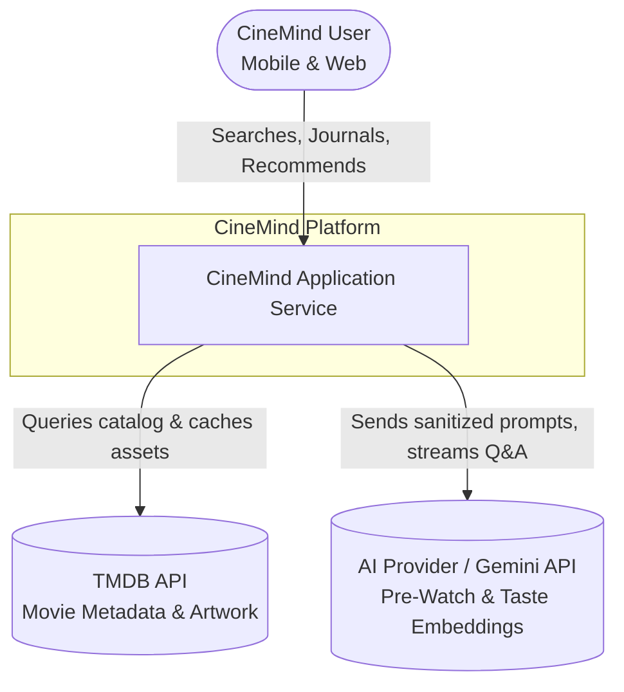
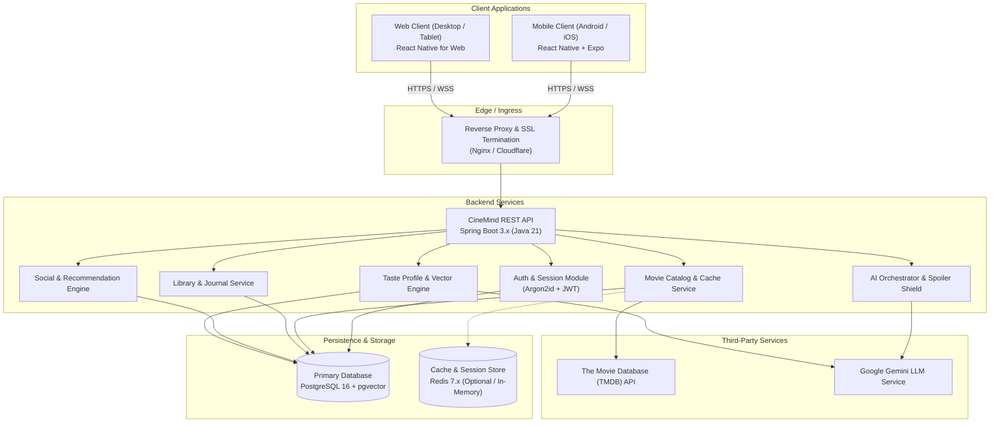
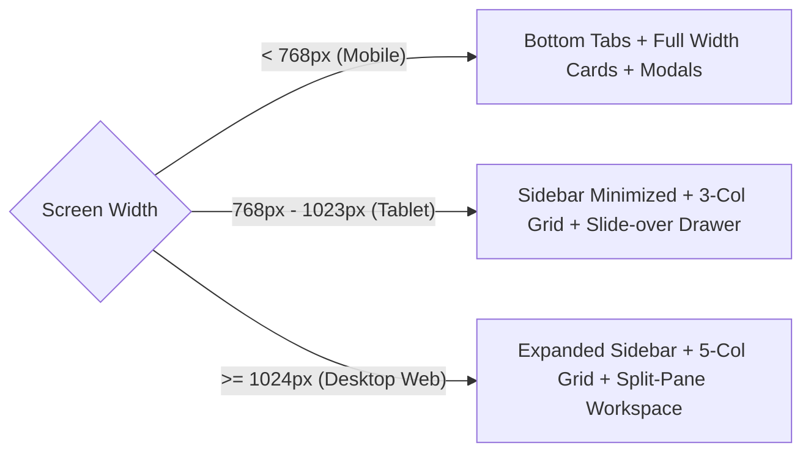
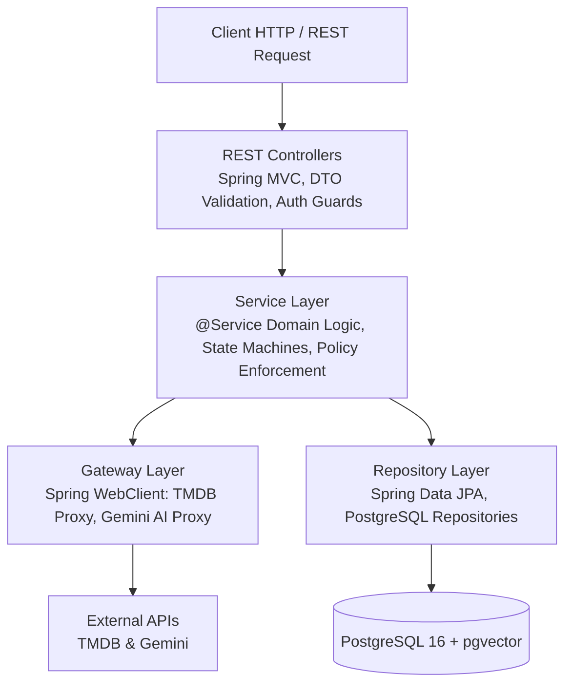
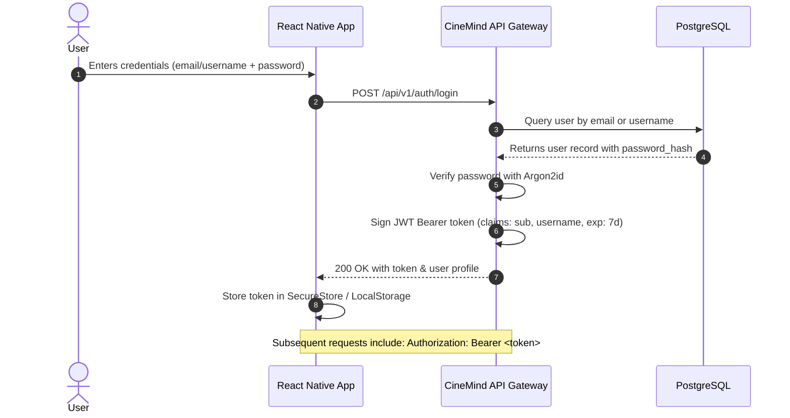
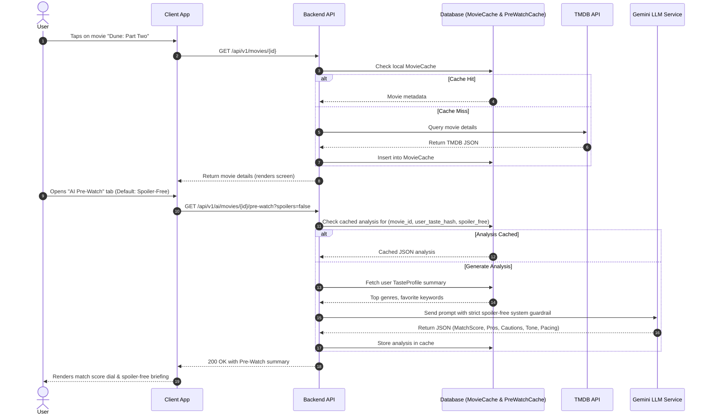
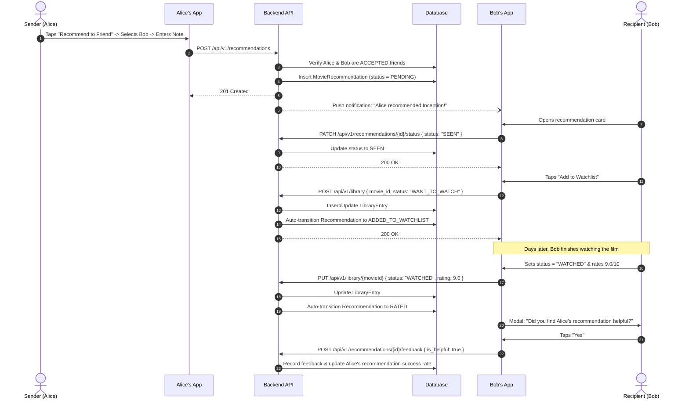
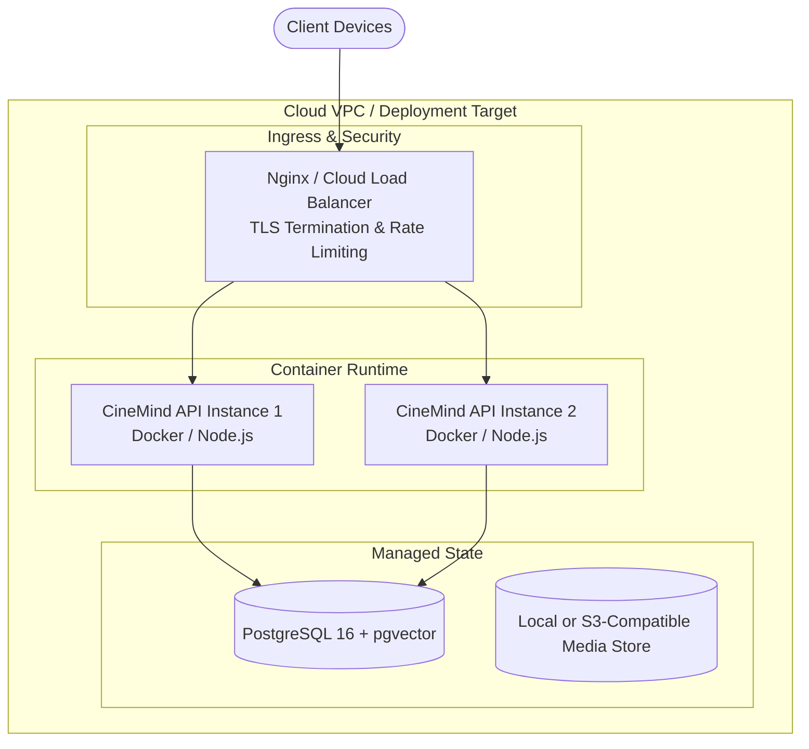

# CineMind — System Architecture Document (SAD)

> **Document Type:** System Architecture Document  
> **Document Number:** 02 — System Architecture  
> **Target Version:** MVP 1.0  
> **Status:** Approved Baseline  
> **Traceability References:**  
> - Project Brief: `docs/project_brief.md`  
> - Product Requirements Document: `docs/product-requirements.md`  
> - User Stories: `docs/user-stories.md`  

---

## 1. Executive Summary & Architectural Principles

CineMind is an integrated, cross-platform movie companion platform uniting a **Personal Movie Journal**, a **Spoiler-Safe AI Movie Assistant**, and an **Accountable Social Recommendation Engine**.

The system is designed around five non-negotiable architectural principles:
1. **Unified Client Surface:** A single shared TypeScript codebase targeting Android, iOS, and Desktop Web via React Native and Expo, adapting layouts dynamically between hand-held screens and desktop viewports.
2. **Server-Brokered Third-Party Isolation:** Clients never directly invoke external movie catalogs (TMDB) or AI services (LLMs). The centralized Backend API proxies all external integrations, safeguarding secret keys, caching expensive queries, injecting user taste context, and enforcing privacy boundaries.
3. **Strict Spoiler Quarantine:** The architecture enforces a server-side and client-side spoiler defense perimeter. AI prompts, responses, and summaries default to spoiler-free semantics unless explicitly authorized by the user.
4. **Deterministic State Lifecycles:** Recommendation and library states transition through strict, predictable state machines, ensuring automated progression (e.g., adding a recommendation to the watchlist automatically updates the social lifecycle).
5. **Private-by-Default Data Isolation:** Journal entries, personal viewing reflections, and taste vectors are cryptographically tied to user ownership and excluded from all public or unconfirmed-friend query scopes.

---

## 2. System Overview & C4 Model

### 2.1 Context Diagram (C4 Level 1)

The CineMind system acts as the central hub connecting end users, external film databases, and AI model providers.



### 2.2 Container Diagram (C4 Level 2)



---

## 3. Frontend Architecture

### 3.1 Technology Stack & Platform Reach

| Component | Choice | Rationale |
| :--- | :--- | :--- |
| **Framework** | **React Native (v0.74+) + Expo SDK 51+** | Native execution on iOS and Android; identical DOM compilation for Web. |
| **Language** | **TypeScript 5.x (Strict Mode)** | End-to-end type safety shared with backend data transfer objects (DTOs). |
| **Navigation** | **Expo Router v3 (File-based routing)** | Unified deep-linking, universal tab/stack navigation, and SSR-ready web routing. |
| **State Management** | **TanStack Query (React Query v5) + Zustand** | TanStack Query handles server state, optimistic caching, and pagination; Zustand manages lightweight client-only states (e.g., active modal toggles, spoiler view state). |
| **Local Persistence** | **Expo SecureStore (Mobile) / Web Crypto Storage** | Safe storage of JWT tokens and persistent offline library caches. |
| **UI Components** | **Custom Design System (Tailwind via NativeWind v4)** | Responsive utilities enabling mobile-first flexbox and desktop breakpoint grids without layout stretching. |

### 3.2 Frontend Directory Structure

```text
apps/client/
├── app/                      # Expo Router file-based routes
│   ├── (auth)/               # Unauthenticated routes (login, register, welcome)
│   │   ├── login.tsx
│   │   └── register.tsx
│   ├── (tabs)/               # Main authenticated navigation bar
│   │   ├── _layout.tsx
│   │   ├── explore/          # Discovery, search, trending
│   │   ├── library/          # 4-status movie library
│   │   ├── recommendations/  # Social recommendation inbox & tracking
│   │   └── profile/          # User stats, friends, taste profile
│   ├── movie/
│   │   └── [id].tsx          # Movie detail screen + AI Pre-Watch tab
│   ├── journal/
│   │   └── [movieId].tsx     # Journal editor & history
│   └── _layout.tsx           # Root provider layout (Auth, QueryClient, Theme)
├── src/
│   ├── components/           # Reusable UI primitives (Button, Modal, MovieCard)
│   ├── features/             # Domain modules
│   │   ├── ai/               # Pre-watch cards, Q&A chat bubble, spoiler toggles
│   │   ├── catalog/          # Search bar, genre chips, poster carousel
│   │   ├── library/          # Status picker, rating slider (1.0–10.0), tag editor
│   │   └── social/           # Recommendation card, friend request item
│   ├── hooks/                # Custom React hooks (useAuth, useAdaptiveLayout)
│   ├── services/             # Axios/Fetch API client with JWT interceptor
│   ├── store/                # Zustand stores
│   └── types/                # Shared TypeScript contracts
```

### 3.3 Adaptive Multi-Platform Layout Strategy

The application explicitly avoids naive mobile stretching on wider viewports:
- **Mobile Handsets (< 768px):** Single-column layout, bottom persistent navigation bar, swipe-to-dismiss gestures, bottom sheets for filters and status pickers.
- **Tablet / Desktop Web (≥ 1024px):** Persistent left-hand sidebar navigation, multi-column responsive movie grids (3–5 columns), split-view detail pages (left: movie poster & metadata; center: journal & notes; right: AI Pre-Watch & Q&A panel).



---

## 4. Backend Architecture

### 4.1 Layered Architecture Pattern (Spring Boot 3.x + Java 21)

The backend is built with **Java 21 and Spring Boot 3.x**, following a clean layered architecture with dependency injection:



1. **Controllers:** Spring `@RestController` endpoints validate inputs using Jakarta Validation (`@Valid`), extract authentication from `SecurityContextHolder`, and return standardized `ApiResponse<T>`.
2. **Services:** Enforce core business rules (e.g., BR-LIB-01, RULE-REC-01 to 05), calculate ratings, manage transactional integrity (`@Transactional`), and handle recommendation state synchronizations.
3. **Gateways:** Abstract TMDB and Gemini LLM interactions via non-blocking Spring `WebClient` or RestClient, enforcing resilience and strict spoiler quarantine.
4. **Repositories:** Spring Data JPA repositories with custom JPQL/native queries, backed by Flyway migrations for schema evolution.

### 4.2 Module Boundaries & Responsibilities

- **`AuthModule`:** User registration, password hashing (Argon2id), JWT issuance, refresh/revoke flows.
- **`CatalogModule`:** Ingestion and caching of TMDB movie metadata in the local `movie_cache` table to minimize third-party rate limiting.
- **`LibraryModule`:** 4-status state transitions (`Want to Watch`, `Watching`, `Watched`, `Dropped`), rating validations (1.0–10.0 with 0.5 increments), rewatch counts, and custom tags.
- **`JournalModule`:** Private journal entry storage, viewing context tracking, and owner-only authorization checks.
- **`AIModule`:** Pre-watch prompt synthesis, spoiler quarantine rules, SSE (Server-Sent Events) streaming for conversational Q&A, and mood-based discovery.
- **`SocialModule`:** Friend graph management (requests, accepts, blocks), direct recommendation dispatch, and 5-stage lifecycle synchronization.
- **`TasteModule`:** Incremental aggregation of user viewing habits, genre frequency weighting, and vector embedding maintenance.

---

## 5. External Integrations Architecture

### 5.1 Movie Catalog Integration (TMDB API)

To satisfy `NFR-PERF-01` ($\le 800\text{ ms}$ search response) and honor TMDB rate limits:
1. **Catalog Proxying:** The client never invokes TMDB directly. All queries route to `GET /api/v1/movies/search` or `GET /api/v1/movies/{id}`.
2. **Read-Through Caching (`MovieCache`):**
   - When a movie is viewed, added to a library, or recommended, its canonical TMDB metadata is recorded in `movie_cache`.
   - Subsequent detail requests for known movies resolve locally from `movie_cache` in $< 50\text{ ms}$.
   - Cached records have a configurable TTL (7 days) before background revalidation.
3. **Asset URL Optimization:** Image paths (`poster_path`, `backdrop_path`) are resolved against TMDB CDN URLs with client-requested resolutions (`w500`, `w1280`).

### 5.2 AI LLM Service Integration (Google Gemini)

To satisfy `FR-AI-01` through `FR-AI-07` and `NFR-SAFE-01`:
1. **Prompt Sanitization & Injection:**
   - The backend constructs prompts by combining the movie's synopsis, cast, genres, and the user's top taste vectors.
   - For pre-watch summaries, structured output (JSON schema mode) is enforced.
2. **Strict Spoiler Quarantine Filter:**
   ```text
   User Request (Spoiler-Free) 
     ──> Server injects system rule: "CRITICAL: Do NOT disclose killers, endings, or major twists." 
     ──> LLM generation 
     ──> Server heuristic spoiler check 
     ──> Client display with "Spoiler-Free" badge.
   ```
3. **Streaming Conversational Q&A:**
   - Real-time movie Q&A (`/api/v1/ai/movies/{movieId}/qa`) uses Server-Sent Events (SSE) to achieve a time-to-first-token latency of $< 1.2\text{ seconds}$ (`NFR-PERF-02`).

---

## 6. Authentication, Authorization & Security Architecture

### 6.1 Authentication Lifecycle



### 6.2 Data Isolation & Privacy Rules

- **Zero Public Journal Access (`NFR-SEC-01`):** Journal queries strictly enforce `WHERE library_entry.user_id = :authenticated_user_id`. Any request querying another user's journal aborts with `403 Forbidden`.
- **Friendship-Gated Recommendations:** A user can only dispatch recommendations to target accounts whose friendship status is `ACCEPTED`. Blocked users are filtered out at the repository level.
- **Credential Storage:** Passwords hashed with `Argon2id` (memory cost 64MB, time cost 3, parallelism 1). No plaintext passwords ever hit disk or application logs.

---

## 7. Core End-to-End Data Flows

### 7.1 Movie Discovery & Pre-Watch AI Flow



### 7.2 Social Recommendation Lifecycle Flow



---

## 8. Infrastructure, Deployment & DevOps

### 8.1 Deployment Architecture



- **Containerization:** The backend is packaged into a hardened multi-stage Docker container based on `node:20-alpine`.
- **Environment Parity:** Identical configuration structures across `development`, `staging`, and `production` driven by strictly validated environment variables.
- **Client Deployment:**
  - **Android / iOS:** Expo Application Services (EAS Build & Submit) producing `.aab` and `.ipa` artifacts.
  - **Desktop Web:** Static bundle exported via `expo export -p web` deployed to edge CDN (Cloudflare Pages / Vercel).

### 8.2 Logging, Monitoring & Observability

- **Structured Logging:** Pino JSON logger outputting timestamped, contextual log lines containing `requestId`, `userId`, `durationMs`, and `statusCode`.
- **Health Checks:**
  - `GET /health/live`: Proves API process responsiveness.
  - `GET /health/ready`: Validates active connectivity to PostgreSQL and external gateway reachability.
- **Error Tracking:** Integration hooks for Sentry or equivalent error monitoring capturing unhandled rejections without logging personal journal texts or authorization headers.

---

## 9. Architecture Decision Records (ADRs)

### ADR-001: Frontend Framework Selection — React Native + Expo
- **Context:** CineMind must ship on Android, iOS, and Web while maintaining a unified developer velocity for an MVP.
- **Decision:** Adopt React Native with Expo SDK (file-based Expo Router).
- **Consequences:** Maximizes code sharing (~90% shared UI/logic). Requires disciplined responsive layout design using flexbox grids to ensure desktop web screens do not feel like stretched mobile interfaces.

### ADR-002: Backend Framework Selection — Java 21 + Spring Boot 3.x
- **Context:** The backend coordinates authentication, catalog caching, AI proxying, journaling, and social interactions, requiring robust enterprise typing, transaction management, and ecosystem maturity.
- **Decision:** Adopt Java 21 with Spring Boot 3.x, utilizing Spring Web, Spring Security (JWT), Spring Data JPA, and Flyway.
- **Consequences:** Provides rock-solid ACID transaction handling, clear dependency injection boundaries, and enterprise observability. WebClient handles asynchronous proxying to TMDB and Gemini LLM.

### ADR-003: Relational Database with PostgreSQL + Vector Extensions
- **Context:** CineMind requires ACID-compliant relational integrity for friendships and recommendations, plus vector storage for AI taste profile similarity.
- **Decision:** PostgreSQL 16 with `pgvector` extension.
- **Consequences:** Eliminates the need for a separate standalone vector database (e.g., Pinecone/Milvus) during MVP. JSONB provides flexible storage for genre frequency maps while retaining strict foreign keys for library states.

### ADR-004: Server-Side AI & Catalog Proxying
- **Context:** Clients require TMDB film data and Gemini LLM analysis. Direct client calls would expose API keys and prevent user-specific taste conditioning.
- **Decision:** All external catalog and LLM requests must be brokered through backend services.
- **Consequences:** Minimizes API secret exposure, permits server-side caching of expensive requests, and allows the backend to inject user taste profiles into system prompts transparently.

### ADR-005: Two-Tier Spoiler Defense Architecture
- **Context:** Accidentally revealing plot twists in pre-watch summaries or Q&A destroys user trust.
- **Decision:** Implement a dual-layer defense:
  1. *Prompt Engineering Layer:* Strict system guardrails commanding the LLM to omit narrative endings, twists, and character deaths.
  2. *Application Policy Layer:* Explicit client-side confirmation modals required before the backend allows any query with `spoilers=true`.
- **Consequences:** Zero accidental spoilers. Controlled opt-in for viewers who desire deep analytical plot discussion.
